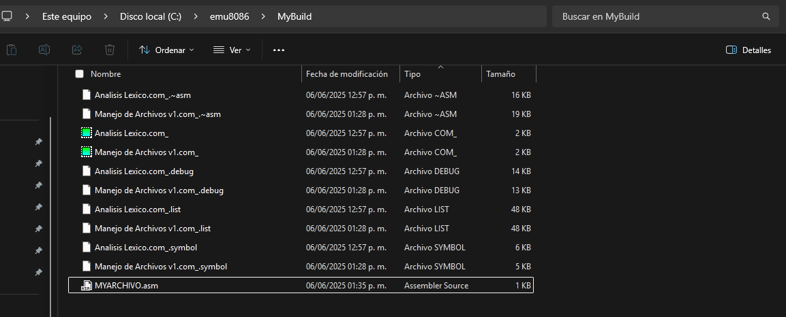
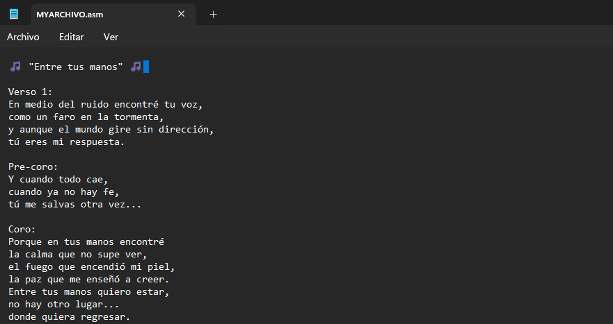
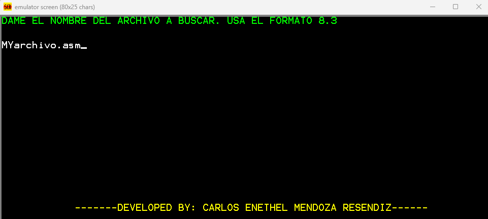
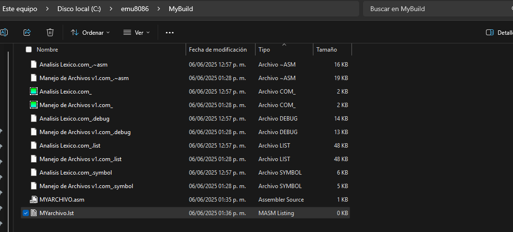
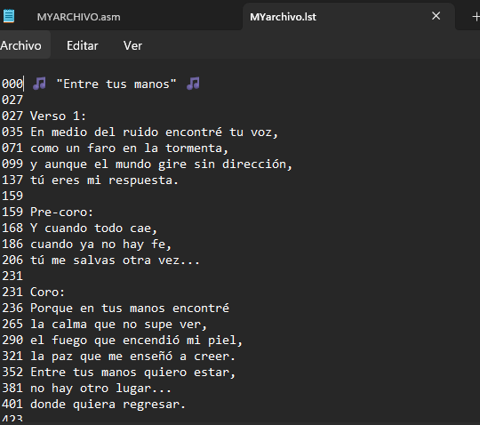
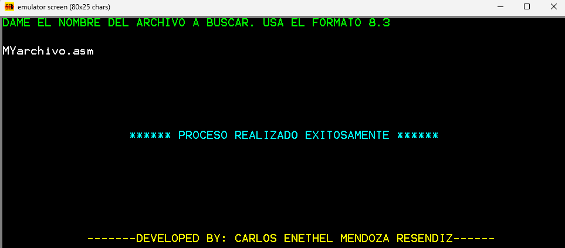
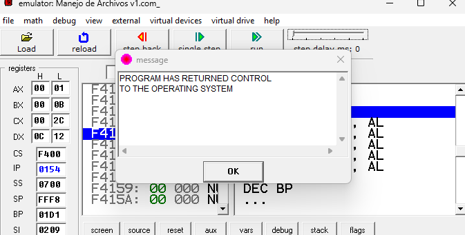

# Manejo-de-Archivos-en-ASM
Manejo de Archivos en ASM
# 📄 Programa en Ensamblador: Procesamiento de Archivo `.asm` y Generación de Archivo `.lst`

Este proyecto implementa un programa en lenguaje ensamblador que lee un archivo de texto con extensión `.asm`, cuenta los caracteres acumulados por línea (incluyendo saltos de línea), y genera un nuevo archivo con extensión `.lst`, mostrando el conteo acumulado seguido del contenido original de cada línea.

---

## 📝 Descripción general

El programa realiza las siguientes tareas principales:

### 1. 📥 Lectura de archivo `.asm`
- Solicita al usuario el **nombre del archivo de entrada** a través del teclado.
- Es capaz de **leer archivos desde cualquier ruta o unidad**, no limitado a un solo directorio.

### 2. 🧮 Procesamiento de contenido
- Cuenta el número de caracteres de **cada línea** del archivo.
- Mantiene un **contador acumulativo** de caracteres, incluyendo los saltos de línea (`CR` y `LF`).
- Utiliza una variable para almacenar la cantidad total acumulada.

### 3. 📤 Generación del archivo `.lst`
- Crea un archivo de salida con el **mismo nombre**, pero extensión `.lst`.
- Cada línea del archivo de salida contiene:
  - El número de caracteres acumulados hasta esa línea (en formato de **tres dígitos**: `000`, `012`, `027`, etc.).
  - El contenido original de la línea leída del archivo `.asm`.

---

## 📚 Ejemplo de funcionamiento

### 🔸 Archivo de entrada (`archivo.asm`)
```asm
hola que tal
como has estado

esto es una prueba
para contar caracteres.
```
### 🔸 Archivo de salida (`archivo.lst`)
```lst
000 hola que tal
012 como has estado
027 
028 esto es una prueba
046 para contar caracteres.
068 
```
---

## 📌 Requisitos y características técnicas

- ✅ **El programa imprime en pantalla mi nombre**

- 🧮 **Utiliza una variable acumuladora** para contar caracteres línea por línea.

- 💾 **Emplea la interrupción `21h`** para realizar todas las operaciones de entrada/salida con el sistema.

- ❌ **Manejo adecuado de errores**, tales como:
  - Archivo no encontrado
  - Problemas de acceso o permisos de lectura

- 📦 **El archivo de salida `.lst` se guarda en la misma ruta** donde se encuentra el archivo `.asm` de entrada.

- 🧵 **Al finalizar correctamente, el registro `SP` (Stack Pointer) debe contener el valor `FFF8h`**, lo que garantiza una terminación segura del programa y el retorno adecuado al sistema operativo.

---

## 🖼️ Capturas de pantalla del programa

### 🔹 Archivo fuente `.ASM`
Visualización del archivo ensamblador principal.  


---

### 🔹 Contenido del archivo `.ASM`
Se muestra el código fuente en lenguaje ensamblador.  


---

### 🔹 Selección del archivo `.ASM`
Proceso de búsqueda y carga del archivo desde el entorno.  


---

### 🔹 Archivo `.LST` generado correctamente
Confirmación de que el archivo listado fue generado sin errores.  


---

### 🔹 Contenido del archivo `.LST`
Vista detallada del contenido del archivo listado.  


---

### 🔹 Finalización del conteo de caracteres
El proceso de conteo de caracteres se completó exitosamente.  


---

### 🔹 Finalización exitosa del programa
El programa concluyó su ejecución de manera correcta.  


